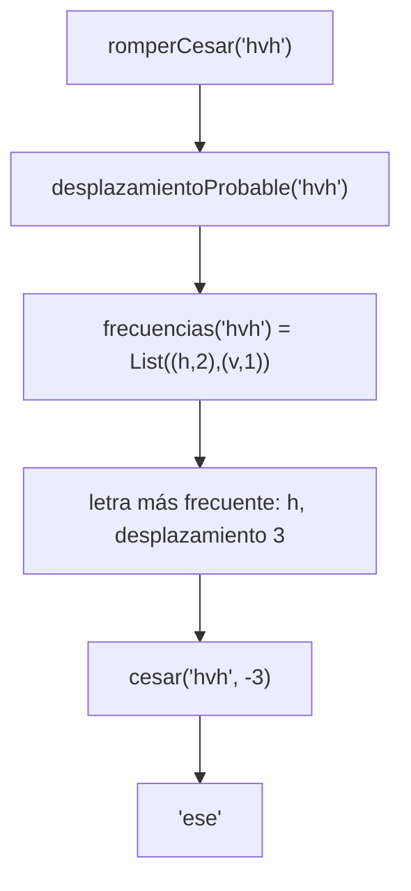
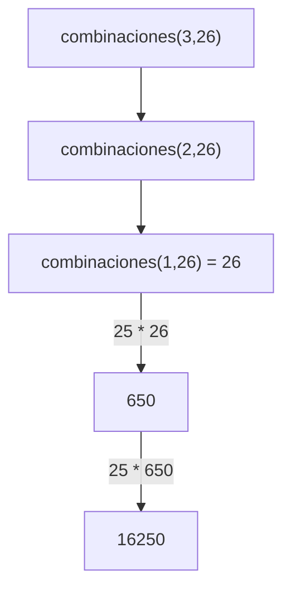

# Ejemplo de informe de corrección

Fundamentos de Programación Funcional y Concurrente.
Documento realizado por el docente Juan Francisco Díaz.

## 1. Argumentar la corrección de programas recursivos

Sea $f : A \to B$ una función, y $A$ un conjunto definido recursivamente
(recordar la definición de Matemáticas Discretas I), como por ejemplo los
naturales o las listas.

Sea $P_f$ un programa recursivo (lineal o en árbol) desarrollado en Scala (o en
cualquier lenguaje de programación) hecho para calcular $f$:

```scala
def Pf(a: A): B = { // Pf recibe a de tipo A, y devuelve f(a) de tipo B
  ...
}
```

¿Cómo argumentar que $P_f(a)$ siempre devuelve $f(a)$ como respuesta? Es decir,
¿cómo argumentar que $P_f$ es correcto con respecto a su especificación?

La respuesta es sencilla: demostrando el siguiente teorema.

```math
\forall a \in A : P_f(a) == f(a)
```

Cuando uno tiene que demostrar que algo se cumple para todos los elementos de
un conjunto definido recursivamente, es natural usar inducción estructural. En
términos prácticos, esto significa demostrar que:

- Para cada valor básico $a$ de $A$, se tiene que $P_f(a) == f(a)$.
- Para cada valor $a \in A$ construido recursivamente a partir de otro(s)
  valor(es) $a' \in A$, se tiene que
  $P_f(a') == f(a') \rightarrow P_f(a) == f(a)$. (Esta es la hipótesis de
  inducción).

### Ejemplo: factorial recursivo

Sea $f : \mathbb{N} \to \mathbb{N}$ la función que calcula el factorial de un
número natural, es decir, $f(n) = n!$. Y sea $P_f$ el siguiente programa en
Scala:

```scala
def Pf(n: Int): Int = { // Pf recibe n de tipo Int, y devuelve n! de tipo Int
  if (n == 0) 1 else n * Pf(n - 1)
}
```

Vamos a demostrar que $\forall n \in \mathbb{N} : P_f(n) == n!$

**Caso base:** $n = 0$

```math
P_f(0) \rightarrow \text{if } (0 == 0)\ 1 \text{ else } 0 \ast P_f(-1) \rightarrow 1
```

Por otro lado, $f(0) = 0! = 1$. Entonces $P_f(0) == f(0)$.

**Caso de inducción:** $n = k + 1$, $k \geq 0$. Hay que demostrar:
$P_f(k) == f(k) \rightarrow P_f(k + 1) == f(k + 1)$

```math
P_f(k+1) \rightarrow \text{if } (k+1 == 0)\ 1 \text{ else } (k+1) \ast P_f(k) \rightarrow (k+1) \ast P_f(k)
```

Usando la hipótesis de inducción (HI):

```math
\rightarrow (k+1) \ast k! = (k+1)!
```

Por lo tanto, $P_f(k + 1) == f(k + 1)$.

Concluimos por inducción que $\forall n \in \mathbb{N} : P_f(n) == n!$

### Ejemplo: el máximo de una lista

Sea $f : \text{List}[\mathbb{N}] \to \mathbb{N}$ la función que calcula el
máximo de una lista de enteros positivos, no vacía. Y sea $P_f$ el siguiente
programa en Scala:

```scala
def maxLin(l: List[Int]): Int = {
  if (l.tail.isEmpty) l.head
  else math.max(maxLin(l.tail), l.head)
}
```

Demostraremos que:

```math
\forall n \in \mathbb{N} \setminus \{0\} : P_f(\text{List}(a_1, a_2, \ldots, a_n)) == f(\text{List}(a_1, a_2, \ldots, a_n))
```

**Caso base:** $n = 1$

```math
P_f(\text{List}(a_1)) \rightarrow \text{if } \text{List}(a_1).\text{tail.isEmpty then } \text{List}(a_1).\text{head else } \ldots \rightarrow \text{List}(a_1).\text{head} \rightarrow a_1
```

Por otro lado, $f(\text{List}(a_1)) = a_1$. Entonces
$P_f(\text{List}(a_1)) == f(\text{List}(a_1))$.

**Caso de inducción:** $n = k + 1$, $k \geq 1$. Se debe demostrar:

```math
P_f(\text{List}(b_1, b_2, \ldots, b_k)) == f(\text{List}(b_1, b_2, \ldots, b_k)) \rightarrow P_f(\text{List}(a_1, a_2, \ldots, a_{k+1})) == f(\text{List}(a_1, a_2, \ldots, a_{k+1}))
```

Empecemos por calcular qué devuelve $P_f$ usando el modelo de sustitución:

```math
P_f(L) \rightarrow \text{if } L.\text{tail.isEmpty then } L.\text{head else math.max}(P_f(L.\text{tail}), L.\text{head})
```

```math
\rightarrow \text{math.max}(P_f(\text{List}(a_2, \ldots, a_{k+1})), a_1)
```

Sea $b = P_f(\text{List}(a_2, \ldots, a_{k+1}))$; por la hipótesis de
inducción, $b = f(\text{List}(a_2, \ldots, a_{k+1}))$. Hay dos posibilidades:

- Si $\text{math.max}(b, a_1) = b$, entonces $b \geq a_1$ y
 $b == f(\text{List}(a_1, a_2, \ldots, a_{k+1}))$.
- Si $\text{math.max}(b, a_1) = a_1$, entonces $a_1 \geq b$ y
 $a_1 == f(\text{List}(a_1, a_2, \ldots, a_{k+1}))$.

Por lo tanto, $P_f(L) == f(L)$.

Concluimos por inducción que:

```math
\forall n \in \mathbb{N} \setminus \{0\} : P_f(\text{List}(a_1, a_2, \ldots, a_n)) == f(\text{List}(a_1, a_2, \ldots, a_n))
```

## 2. Argumentar la corrección de programas iterativos

Para argumentar la corrección de programas iterativos, se debe formalizar cómo
es la iteración. Esto implica definir:

- Cómo se representa un estado de la iteración, $s$.
- Cuál es el estado inicial, $s_0$.
- Cuál es el estado final (o cómo se reconoce que un estado es final): $s_f$.
- Qué condición (o predicado) cumple todo estado: $\text{Inv}(s)$ (invariante
  de la iteración).
- El mecanismo para pasar de un estado al siguiente: $\text{transformar}(s)$.
  Si $s_i$ es el estado $i$, entonces $\text{transformar}(s_i) = s_{i+1}$.

Un programa iterativo tiene la siguiente forma:

```scala
def Pf(a: A): B = { // Pf recibe a de tipo A, y devuelve f(a) de tipo B
  def Pf_iter(s: Estado): B =
    if (esFinal(s)) respuesta(s) else Pf_iter(transformar(s))
  Pf_iter(s0)
}
```

Demostración de corrección:

- $\text{Inv}(s_0)$: el estado inicial cumple la condición invariante.
- Si $(s_i \neq s_f \land \text{Inv}(s_i)) \rightarrow \text{Inv}(\text{transformar}(s_i))$:
  el nuevo estado cumple la condición invariante si el estado anterior la
  cumplía.
- De lo anterior se concluye $\text{Inv}(s_f)$, es decir, el estado final
  cumple la condición invariante. Luego,
  $\text{Inv}(s_f) \rightarrow \text{respuesta}(s_f) == f(a)$.
- Finalmente, demostrar que siempre se llega al estado final $s_f$. Esto
  implica que
  $P_f(a) == \text{iter}(s_0) == \text{respuesta}(s_f) == f(a)$.

### Ejemplo: factorial iterativo

Considere el siguiente programa iterativo en Scala para calcular la función
factorial:

```scala
def Pf(n: Int): Int = { // Pf recibe n de tipo Int, y devuelve n! de tipo Int
  def Pf_iter(i: Int, n: Int, ac: Int): Int =
    if (i > n) ac else Pf_iter(i + 1, n, i * ac)
  Pf_iter(1, n, 1)
}
```

Este programa implementa el siguiente proceso iterativo:

- Un estado $s = (i, n, ac)$.
- El estado inicial es $s_0 = (1, n, 1)$.
- $(i, n, ac)$ es final si $i > n$, o lo que es lo mismo, si $i = n + 1$.
- La invariante de ciclo es
  $\text{Inv}(i, n, ac) \equiv i \leq n + 1 \land ac = (i-1)!$.
  La invariante de ciclo es una relación que SIEMPRE se cumple en el ciclo.
- $\text{transformar}((i, n, ac)) = (i+1, n, i \ast ac)$.

Ahora, demostramos los puntos mencionados:

**1.** $\text{Inv}(s_0)$: el estado inicial cumple la condición invariante.

```math
s_0 = (1, n, 1) \implies 1 \leq n + 1 \land 1 = 0!
```

**2.** La invariante se mantiene con la transformación de estados,
$(s_i \neq s_f \land \text{Inv}(s_i)) \rightarrow \text{Inv}(\text{transformar}(s_i))$:

1. Primer cambio, $i = i + 1$, lo que implica $ac = ((i+1) - 1)! = i!$.
2. Segundo cambio, $ac = i \ast ac$, entonces $ac = (i - 1)! \ast i = i!$.
3. Como se puede ver en ambos cambios indicados en la transformación, la
   invariante se mantiene.

**3.** $\text{Inv}(s_f) \rightarrow \text{respuesta}(s_f) == f(a)$

```math
(n + 1 \leq n + 1) \land ac = ((n+1)-1)! \rightarrow ac == n!
```

**4.** En cada paso, la componente $i$ del estado incrementa, acercándose a $n+1$.
Después de $n$ iteraciones, se alcanza $n+1$.

Esto implica que $P_f(n) == \text{iter}(1, n, 1) == n!$

### Ejemplo: el máximo de una lista

Se desea calcular el máximo de una lista de enteros positivos, no vacía. Sea
$f : \text{List}[\mathbb{N}] \to \mathbb{N}$ la función que calcula ese valor.
Y sea $P_f$ el siguiente programa en Scala:

```scala
def maxIt(l: List[Int]): Int = {
  def maxAux(max: Int, l: List[Int]): Int = {
    if (l.isEmpty) max
    else maxAux(math.max(max, l.head), l.tail)
  }
  maxAux(l.head, l.tail)
}
```

Este programa implementa el siguiente proceso iterativo:

- Un estado $s = (max, l)$ donde $l = \text{List}(a_i, a_{i+1}, \ldots, a_k)$
  es una cola de $L$.
- El estado inicial es
  $s_0 = (L.\text{head}, L.\text{tail}) = (a_1, \text{List}(a_2, \ldots, a_k))$.
- $s = (max, l)$ es final si $l$ es vacía.
- $\text{Inv}(max, l) \equiv l = \text{List}(a_i, a_{i+1}, \ldots, a_k) \land max = f(\text{List}(a_1, a_2, \ldots, a_{i-1}))$.
- $\text{transformar}((max, l)) = (nmax, l.\text{tail})$ donde $nmax = max$ si
  $max \geq l.\text{head}$, y $nmax = l.\text{head}$ si no.

Demostración de los puntos:

**1.** $\text{Inv}(s_0)$: el estado inicial cumple la condición invariante.

```math
s_0 = (a_1, \text{List}(a_2, \ldots, a_k)) \implies a_1 = f(\text{List}(a_1))
```

**2.** $(s_i \neq s_f \land \text{Inv}(s_i)) \rightarrow \text{Inv}(\text{transformar}(s_i))$

```math
\neg\, l.\text{isEmpty} \land l = \text{List}(a_i, a_{i+1}, \ldots, a_k) \land max = f(\text{List}(a_1, a_2, \ldots, a_{i-1}))
```

```math
\rightarrow l.\text{tail} = \text{List}(a_{i+1}, \ldots, a_k) \land nmax = f(\text{List}(a_1, \ldots, a_i))
```

**3.** $\text{Inv}(s_f) \rightarrow \text{respuesta}(s_f) == f(a)$

```math
\text{Inv}((max, \text{List}())) \rightarrow max = f(\text{List}(a_1, \ldots, a_k))
```

**4.** En cada paso, la lista $l$ se reduce, acercándose a ser vacía. Después de
$k$ iteraciones, $l = \text{List}()$.

Esto implica que $P_f(L) == \text{maxAux}(L.\text{head}, L.\text{tail}) == f(L)$


---

## Punto 1: corrección de `cesar`

Sea $f(m, k)$ la especificación: la cadena que resulta de reemplazar cada letra
minúscula $c$ de $m$ por la letra $\big((c - a + k) \bmod 26\big) + a$ y de
dejar igual cualquier otro carácter. Queremos probar que
$\forall m \in \text{String},\ \forall k \in \mathbb{Z} : P_{cesar}(m, k) == f(m, k)$.

Se hace inducción estructural sobre $m$.

- **Caso base:** $m = \text{""}$. El programa devuelve `""`, y la
  especificación sobre la cadena vacía también da `""`.
- **Paso inductivo:** $m = c \cdot m'$. Por hipótesis de inducción,
  $P_{cesar}(m', k) == f(m', k)$. El programa devuelve
  `desplazar(c) + cesar(m', k)`, que por la hipótesis es
  `desplazar(c) + f(m', k)`. Como `desplazar` aplica exactamente la fórmula de
  la especificación a una letra minúscula, y deja igual cualquier otro
  carácter, esto es $f(c \cdot m', k)$.

Por lo tanto $P_{cesar}$ es correcto.


---

# Informe de corrección: puntos 4 y 5

## Cómo se argumenta la corrección

Para un programa recursivo $P_f$ que calcula una función $f$, se demuestra por inducción que

```math
\forall a \in A : P_f(a) == f(a)
```

Se usa el modelo de sustitución: se reemplaza cada llamada por el cuerpo de la función y se sigue reduciendo. Las funciones no usan variables mutables ni efectos, así que una llamada se puede reemplazar por su resultado sin cambiar el programa.

### Notación

Sea $\Sigma = \{a, \dots, z\}$ con $\text{pos}(a) = 0, \dots, \text{pos}(z) = 25$. Para un carácter $c$ y un desplazamiento $k \in \mathbb{Z}$:

$$
d_k(c) =
\begin{cases}
\text{chr}\big((\text{pos}(c) + k) \bmod 26\big) & \text{si } c \in \Sigma \\
c & \text{en otro caso}
\end{cases}
\qquad
\text{César}(c_1 c_2 \cdots c_n,\, k) = d_k(c_1)\, d_k(c_2) \cdots d_k(c_n)
$$

Los puntos 4 y 5 usan dos resultados de los puntos 1 y 3, que se toman como ya demostrados en sus propias secciones:

- **(P1)** $\text{cesar}(m, k) = \text{César}(m, k)$ para todo $m$ y todo $k \in \mathbb{Z}$.
- **(P3)** `frecuencias(m)` devuelve las letras que aparecen en $m$ con sus cuentas, ordenadas de mayor a menor frecuencia y, en empate, alfabéticamente.

---

## Punto 4: `desplazamientoProbable` y `romperCesar`

Estas funciones no son recursivas: componen las de los puntos 1 y 3. La corrección se argumenta con el modelo de sustitución.

### Especificación

Sea $\ell(m)$ la primera letra de `frecuencias(m)`, es decir, la letra más frecuente de $m$ (en empate, la menor alfabéticamente). Con $\text{pos}(e) = 4$:

$$
f_4(m) = \hat{k}(m) =
\begin{cases}
0 & \text{si } m \text{ no tiene letras} \\
\big(\text{pos}(\ell(m)) - \text{pos}(e)\big) \bmod 26 & \text{en otro caso}
\end{cases}
\qquad
f_{4'}(m) = \text{César}\big(m, -\hat{k}(m)\big)
$$

### `desplazamientoProbable(m) == `$\hat{k}(m)$

Con el modelo de sustitución, si `fs = frecuencias(m)`:

```math
\text{desplazamientoProbable}(m) \rightarrow \text{if } (fs.\text{isEmpty})\ 0 \text{ else } (\ell - \text{'e'} + 26) \% 26
```

- **Sin letras.** Por (P3), `fs` es vacía y el resultado es $0 = \hat{k}(m)$.
- **Con letras.** Por (P3), `fs.head` es el par de la letra más frecuente, así que `letraMasFrecuente` $= \ell(m)$. El valor $\text{pos}(\ell) - 4$ está entre $-4$ y $21$. Sumar $26$ lo deja entre $22$ y $47$, y `% 26` lo lleva a $[0, 25]$ sin cambiar el residuo módulo 26. Por tanto el resultado es $\big(\text{pos}(\ell) - \text{pos}(e)\big) \bmod 26 = \hat{k}(m)$.

Casos del enunciado: en `"h"`, $\text{pos}(h) = 7$ y $(7 - 4 + 26) \bmod 26 = 3$. En `"hhhaaa"` hay empate, gana la `a` y $(0 - 4 + 26) \bmod 26 = 22$.

### `romperCesar(m) == `$\text{César}(m, -\hat{k}(m))$

```math
\text{romperCesar}(m) \rightarrow \text{cesar}(m, -\text{desplazamientoProbable}(m)) \rightarrow \text{cesar}(m, -\hat{k}(m)) = \text{César}(m, -\hat{k}(m))
```

La primera flecha es el cuerpo de la función, la segunda usa lo demostrado arriba y la igualdad final es (P1). $\blacksquare$

### Cómo se encadenan los llamados

Con `romperCesar("hvh")`:

1. `romperCesar("hvh")` llama a `desplazamientoProbable("hvh")`.
2. Este llama a `frecuencias("hvh")`, que devuelve `List((h,2), (v,1))`.
3. La letra más frecuente es `h`: $(7 - 4 + 26) \bmod 26 = 3$.
4. `romperCesar` llama a `cesar("hvh", -3)`, que devuelve `"ese"`.



### Cuándo acierta

**Afirmación.** Sea $t$ un texto en el que la `e` aparece estrictamente más veces que cualquier otra letra, y sea $m = \text{César}(t, k)$. Entonces $\hat{k}(m) = k \bmod 26$ y $\text{romperCesar}(m) = t$.

*Demostración.*

1. Cifrar mueve cada letra $k$ posiciones, pero no cambia cuántas veces aparece cada una. Por eso la letra más frecuente de $m$ (única, porque la `e` le gana a todas) es la `e` corrida: tiene posición $r = (4 + k) \bmod 26$.
2. Entonces $\hat{k}(m) = (r - 4) \bmod 26$. Como $r \equiv 4 + k \pmod{26}$, resulta $\hat{k}(m) = k \bmod 26$.
3. Por lo demostrado arriba, $\text{romperCesar}(m) = \text{César}(m, -\hat{k}(m))$. Descifrar con $-k$ deshace cifrar con $k$, porque $\big((p + k) - k\big) \bmod 26 = p$ para cada letra y los demás caracteres no cambian. Así $\text{romperCesar}(m) = t$. $\blacksquare$

### Cuándo falla

El método falla cuando **la letra más repetida del mensaje original no es la `e`** (o hay un empate que se resuelve hacia otra letra): el método supone que sí lo es, y el desplazamiento estimado resulta distinto del real. Pasa sobre todo en textos cortos o con palabras poco comunes.

**Mensaje concreto: `"casa"`**

| Paso | Resultado |
|------|-----------|
| Se cifra con $k = 3$: `cesar("casa", 3)` | `"fdvd"` |
| Letra más frecuente de `"fdvd"` | `d` (2 veces) |
| Desplazamiento estimado | $(3 - 4 + 26) \bmod 26 = 25$ |
| `romperCesar("fdvd")` = `cesar("fdvd", -25)` | `"gewe"` |

El resultado `"gewe"` no es `"casa"`. En `"casa"` la letra más repetida es la `a`, no la `e`. El desplazamiento real era 3 y el estimado fue 25. Una de las pruebas propias comprueba este caso.

---

## Punto 5: `combinaciones` y `vigenere`

### `combinaciones`

**Especificación** (la del enunciado): $f(n) = C(n, a)$, con

$$
C(0, a) = 1, \qquad C(1, a) = a, \qquad C(n, a) = (a - 1) \cdot C(n - 1, a) \quad (n > 1)
$$

**Programa.**

```scala
def combinaciones(n: Int, a: Int): BigInt =
  if (n == 0) BigInt(1)
  else if (n == 1) BigInt(a)
  else BigInt(a - 1) * combinaciones(n - 1, a)
```

Se fija $a$ y se demuestra por inducción sobre $n \in \mathbb{N}$ que $\forall n : P_f(n) == C(n, a)$.

**Caso base $n = 0$:**

```math
P_f(0) \rightarrow \text{if } (0 == 0)\ \text{BigInt}(1) \text{ else } \ldots \rightarrow 1 = C(0, a)
```

**Caso base $n = 1$:**

```math
P_f(1) \rightarrow \text{if } (1 == 0) \ldots \text{ else if } (1 == 1)\ \text{BigInt}(a) \rightarrow a = C(1, a)
```

**Caso de inducción:** $n = k + 1$, con $k \geq 1$. Hay que demostrar $P_f(k) == C(k, a) \rightarrow P_f(k + 1) == C(k + 1, a)$.

```math
P_f(k+1) \rightarrow \text{BigInt}(a - 1) \ast P_f(k)
```

Como $k + 1 \geq 2$, no se cumple ni $k + 1 == 0$ ni $k + 1 == 1$, y se llega a la última rama. Por la hipótesis de inducción, $P_f(k) = C(k, a)$, luego

```math
P_f(k+1) = (a - 1) \ast C(k, a) = C(k + 1, a)
```

Concluimos por inducción que $\forall n \in \mathbb{N} : P_f(n) == C(n, a)$. $\blacksquare$

**Los dos casos base hacen falta.** Si solo estuviera el de $n = 0$, la fórmula daría $C(1, a) = (a - 1) \cdot 1 = a - 1$, un valor equivocado: el caso base tiene que devolver el valor correcto, no solo detener la recursión.

**Terminación.** Cada llamada baja $n$ en 1, así que desde cualquier $n \geq 1$ se llega a $n = 1$ (se supone $n \geq 0$, como en el enunciado).

**Para comprobar.** Para $n \geq 1$, $C(n, a) = a\,(a-1)^{n-1}$. Con $n = 3$ y $a = 26$: $26 \cdot 25 \cdot 25 = 16250$.

**Cómo se encadenan los llamados** con `combinaciones(3, 26)`:

$$
C(3, 26) = 25 \cdot C(2, 26) = 25 \cdot \big(25 \cdot C(1, 26)\big) = 25 \cdot (25 \cdot 26) = 25 \cdot 650 = 16250
$$



### `vigenere`

**Especificación.** Sea $K = k_0 k_1 \cdots k_{s-1}$ la clave, con $s > 0$. Para una cadena $r$ y un número $p \geq 0$ (las letras que ya se cifraron antes), sea $V(r, p)$ la cadena que resulta de reemplazar cada carácter $r_j$ así:

$$
V(r, p)_j =
\begin{cases}
d_{\text{pos}\left(k_{(p + \lambda(r, j)) \bmod s}\right)}(r_j) & \text{si } r_j \in \Sigma \\
r_j & \text{en otro caso}
\end{cases}
$$

donde $\lambda(r, j)$ es el número de letras de $\Sigma$ que hay en $r$ antes de la posición $j$. El cifrado de Vigenère es $V(m, 0)$: la $i$-ésima letra del mensaje usa la letra $k_{i \bmod s}$ de la clave, y los demás caracteres se copian sin gastar clave.

**Programa.**

```scala
def vigenere(m: Mensaje, clave: Clave): Mensaje = {
  def cifrar(resto: Mensaje, pos: Int): Mensaje =
    if (resto.isEmpty) ""
    else if (esMinuscula(resto.head)) {
      val desplazamiento = clave(pos % clave.length) - primera
      cesar(resto.head.toString, desplazamiento) + cifrar(resto.tail, pos + 1)
    } else
      resto.head.toString + cifrar(resto.tail, pos)

  if (clave.isEmpty) m else cifrar(m, 0)
}
```

**Teorema.** Con $s > 0$: $\forall r, \forall p \geq 0 : \text{cifrar}(r, p) == V(r, p)$. Se demuestra por inducción sobre $|r|$, para todo $p$ a la vez.

**Caso base $r = \varepsilon$:**

```math
\text{cifrar}(\varepsilon, p) \rightarrow \text{if } (\varepsilon.\text{isEmpty})\ \text{""} \rightarrow \varepsilon = V(\varepsilon, p)
```

**Caso de inducción:** $r = c \cdot t$. La hipótesis de inducción dice que $\text{cifrar}(t, p') == V(t, p')$ para **todo** $p' \geq 0$. Hay dos posibilidades:

- **$c \in \Sigma$.** Se toma la segunda rama: se cifra `c` con $\text{pos}(k_{p \bmod s})$ usando `cesar` sobre la cadena de una letra (por (P1) eso es $d_{\text{pos}(k_{p \bmod s})}(c)$), y se sigue con $\text{cifrar}(t, p + 1)$. Por la hipótesis de inducción con $p' = p + 1$, esto es $V(t, p+1)$. Como $c$ es una letra, $\lambda(r, j) = 1 + \lambda(t, j - 1)$ para $j \geq 1$, así que $p + \lambda(r, j) = (p + 1) + \lambda(t, j-1)$, y por tanto $d_{\ldots}(c) \cdot V(t, p+1) = V(r, p)$.
- **$c \notin \Sigma$.** Se toma la tercera rama: se copia `c` y se sigue con $\text{cifrar}(t, p)$, que por la hipótesis de inducción con $p' = p$ es $V(t, p)$. Como $c$ no es letra, $\lambda(r, j) = \lambda(t, j - 1)$, así que $c \cdot V(t, p) = V(r, p)$.

En los dos casos $\text{cifrar}(r, p) == V(r, p)$. Concluimos por inducción que el teorema vale. $\blacksquare$

**Corolario.** Si la clave no está vacía, $\text{vigenere}(m, K) \rightarrow \text{cifrar}(m, 0) = V(m, 0)$, que es el cifrado de Vigenère. Si la clave está vacía se devuelve $m$ sin cambio, como pide el enunciado; ese caso se separa porque `pos % clave.length` dividiría por cero.

**Terminación.** Cada llamada recibe `resto.tail`, una cadena un carácter más corta, y la longitud es un natural.

**Cómo se encadenan los llamados** con `vigenere("hola mundo", "ab")`. La clave `ab` aporta los desplazamientos $0, 1$ y se repite:

| Carácter | `pos` | ¿Letra? | Letra de la clave | Resultado |
|----------|-------|---------|-------------------|-----------|
| `h` | 0 | sí | `a` (0) | `h` |
| `o` | 1 | sí | `b` (1) | `p` |
| `l` | 2 | sí | `a` (0) | `l` |
| `a` | 3 | sí | `b` (1) | `b` |
| ` ` (espacio) | 4 | no | no se usa (se copia, `pos` sigue en 4) | ` ` |
| `m` | 4 | sí | `a` (0) | `m` |
| `u` | 5 | sí | `b` (1) | `v` |
| `n` | 6 | sí | `a` (0) | `n` |
| `d` | 7 | sí | `b` (1) | `e` |
| `o` | 8 | sí | `a` (0) | `o` |

Juntando la última columna queda `"hplb mvneo"`, igual al ejemplo del enunciado. La `m` usa la `a` y no la `b`: el espacio no gastó letra de la clave.
