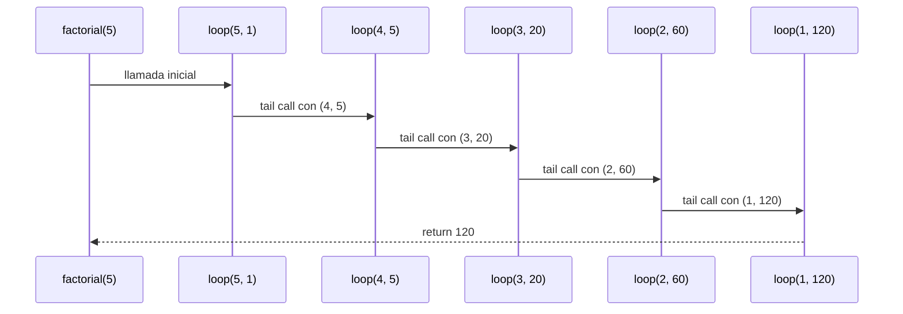
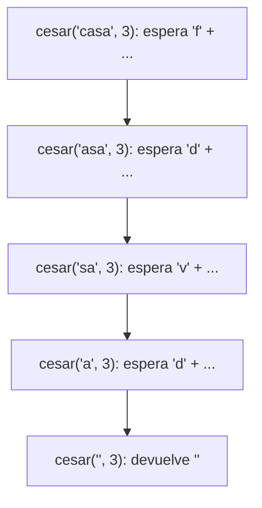
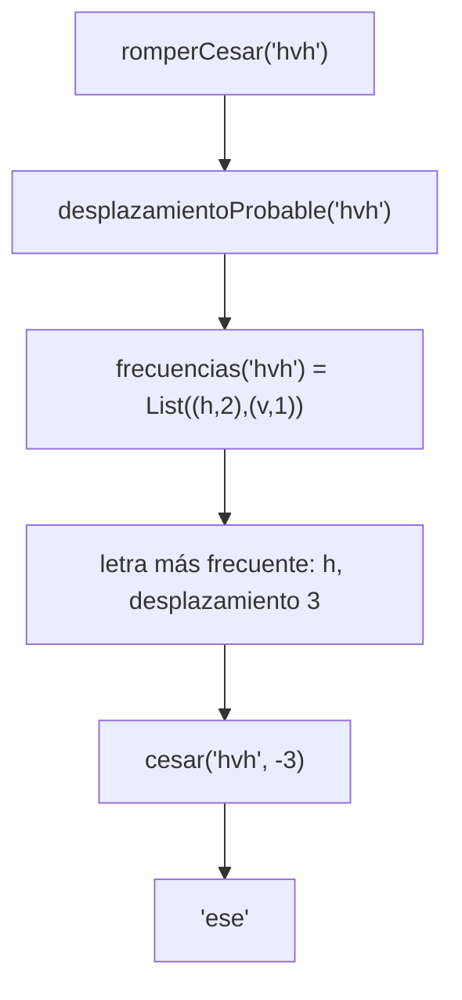
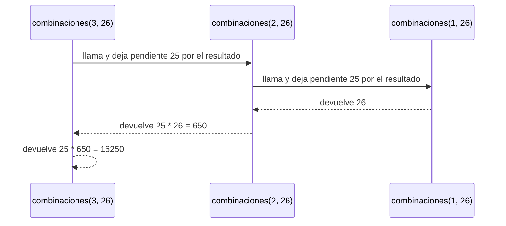
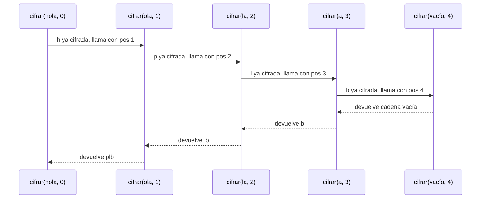

# Algoritmo Factorial con Recursión de Cola

## Definición del Algoritmo

```Scala
def factorial(n: Int): BigInt = {
  @annotation.tailrec
  def loop(x: Int, acumulador: BigInt): BigInt = {
    if (x <= 1) acumulador
    else loop(x - 1, acumulador * x)
  }
  loop(n, 1)
}
```

* La función `factorial` calcula el factorial de un número `n` utilizando **recursión de cola**.
* La función interna `loop` es la que hace la recursión:

  * Recibe dos parámetros:

    * `x`: el valor actual decreciente hasta llegar a 1.
    * `acumulador`: donde se guarda el resultado parcial en cada paso.
* El decorador `@annotation.tailrec` obliga a que la función sea optimizada como recursión de cola, es decir, **no se acumulan llamados en la pila**.

## Explicación paso a paso

### Caso base

```Scala
if (x <= 1) acumulador
```

Cuando `x` llega a `1`, la función retorna directamente el valor acumulado, evitando más llamadas.

### Caso recursivo

```Scala
loop(x - 1, acumulador * x)
```

En cada llamada:

* Se reduce el valor de `x` en 1.
* Se multiplica el acumulador por `x` y se pasa a la siguiente iteración.
* Como es recursión de cola, la llamada recursiva es la **última instrucción** en ejecutarse, lo que permite a Scala optimizar la pila.

---

## Llamados de pila en recursión de cola

Ejemplo:

```Scala
factorial(5)
```

### Paso 1: Llamada inicial

```Scala
loop(5, 1)
```

### Paso 2: Primera iteración

```Scala
loop(4, 5)   // acumulador = 1 * 5
```

### Paso 3: Segunda iteración

```Scala
loop(3, 20)  // acumulador = 5 * 4
```

### Paso 4: Tercera iteración

```Scala
loop(2, 60)  // acumulador = 20 * 3
```

### Paso 5: Cuarta iteración

```Scala
loop(1, 120) // acumulador = 60 * 2
```

### Paso 6: Caso base

```Scala
return 120
```

---

## Diferencia con recursión normal

* En **recursión normal** cada llamada queda en la pila esperando a que termine la siguiente, lo que puede causar desbordamiento si `n` es muy grande.
* En **recursión de cola**, el compilador transforma el proceso en un **bucle optimizado**, por lo que no se guarda cada llamada en la pila y el algoritmo puede ejecutarse para valores muy grandes sin problema.

---

## Ejemplo de uso

```Scala
val resultado = factorial(5)
println(resultado)  // 120
```

El resultado de `factorial(5)` es `120`.


## Diagrama de llamados de pila con recursión de cola




---

## Punto 1: `cesar` con recursión lineal

```scala
def cesar(m: Mensaje, k: Int): Mensaje =
  if (m.isEmpty) "" else desplazar(m.head) + cesar(m.tail, k)
```

### Traza de `cesar("casa", 3)`

```
cesar("casa", 3)
= 'f' + cesar("asa", 3)
= 'f' + ('d' + cesar("sa", 3))
= 'f' + ('d' + ('v' + cesar("a", 3)))
= 'f' + ('d' + ('v' + ('d' + cesar("", 3))))
= 'f' + ('d' + ('v' + ('d' + "")))
= 'f' + ('d' + ('v' + "d"))
= 'f' + ('d' + "vd")
= 'f' + "dvd"
= "fdvd"
```

### Pila de llamados



### ¿Por qué es recursión lineal?

En cada invocación hay un único llamado recursivo, sobre `m.tail`. Además, ese
llamado no es lo último que se hace: al volver queda pendiente la
concatenación con `desplazar(m.head)`. Por eso cada llamado debe esperar en la
pila a que termine el siguiente, y la pila crece una posición por cada letra
del mensaje: para $n$ letras hay $n+1$ llamados activos a la vez, es decir,
espacio $O(n)$.

# Informe de proceso

## Cómo se leen las trazas

Se usa el **modelo de sustitución**: en cada paso se reemplaza una llamada por el cuerpo de la función y se sigue reduciendo.

- La columna **Pendientes** cuenta las operaciones que quedan esperando el resultado de una llamada. El valor más alto de esa columna es el **espacio** del proceso.
- La **pila de llamados** muestra qué llamadas están abiertas (todavía no devolvieron) en un punto de la ejecución. Cada una ocupa un marco.
- En las trazas, `"h"` es una letra ya cifrada, `+` es la concatenación de cadenas y $n$ es el número de caracteres del mensaje.

---

## Punto 4: `desplazamientoProbable` y `romperCesar`

```scala
def desplazamientoProbable(m: Mensaje): Int = {
  val fs = frecuencias(m)
  if (fs.isEmpty) 0
  else {
    val (letraMasFrecuente, _) = fs.head
    (letraMasFrecuente - 'e' + letras) % letras
  }
}

def romperCesar(m: Mensaje): Mensaje =
  cesar(m, -desplazamientoProbable(m))
```

Ninguna de las dos es recursiva por sí misma: llaman a `frecuencias` (punto 3) y a `cesar` (punto 1).

- `fs` es un `val`: `frecuencias(m)` se evalúa **una sola vez**, en el punto de la definición. Con un `def` se evaluaría dos veces, en `fs.isEmpty` y en `fs.head`.
- `fs.head` es la letra más frecuente, porque `frecuencias` ordena de mayor a menor y, en empate, alfabéticamente.
- `letras` vale 26. Restar `'e'` da la distancia entre la letra más frecuente y la `e`, que va de $-4$ a $21$; sumar `letras` evita el resultado negativo y el `%` lo deja entre 0 y 25.

### Traza de `romperCesar("hvh")`

| Paso | Expresión | Qué se hizo |
|------|-----------|-------------|
| 0 | `romperCesar("hvh")` | — |
| 1 | `cesar("hvh", -desplazamientoProbable("hvh"))` | se reemplaza por el cuerpo; los argumentos se evalúan de izquierda a derecha |
| 2 | `cesar("hvh", -3)` | `frecuencias("hvh")` es `List((h,2), (v,1))`; la letra más frecuente es `h`; $(7 - 4 + 26) \bmod 26 = 3$ |
| 3 | `"ese"` | `cesar` con $-3$: `h`→`e`, `v`→`s`, `h`→`e` |

Con empate, en `"hhhaaa"` `frecuencias` devuelve `List((a,3), (h,3))`: gana la `a` y el desplazamiento es $(0 - 4 + 26) \bmod 26 = 22$. Sin letras, `fs` está vacía y el resultado es 0.

### Estado de la pila de llamados

| Punto de la ejecución | Pila (de abajo hacia arriba) |
|-----------------------|------------------------------|
| entra `romperCesar("hvh")` | `romperCesar` |
| evalúa el argumento `-desplazamientoProbable(m)` | `romperCesar`, `desplazamientoProbable` |
| calcula `fs` | `romperCesar`, `desplazamientoProbable`, `frecuencias` |
| `frecuencias` devuelve | `romperCesar`, `desplazamientoProbable` |
| `desplazamientoProbable` devuelve 3 | `romperCesar` |
| llega al fondo de `cesar("hvh", -3)` | `romperCesar`, `cesar("hvh")`, `cesar("vh")`, `cesar("h")`, `cesar("")` |
| `cesar` devuelve `"ese"` | `romperCesar`, y luego vacía |



**Proceso:** `desplazamientoProbable` no deja operaciones pendientes. `romperCesar` termina en `cesar`, que es recursiva lineal, así que su espacio es $\sim n$.

---

## Punto 5: `combinaciones` y `vigenere`

### `combinaciones` (recursión lineal)

```scala
def combinaciones(n: Int, a: Int): BigInt =
  if (n == 0) BigInt(1)
  else if (n == 1) BigInt(a)
  else BigInt(a - 1) * combinaciones(n - 1, a)
```

La multiplicación por $(a - 1)$ queda esperando el resultado de la llamada, como en el `factorial` recursivo.

**Traza de `combinaciones(3, 26)`**

| Paso | Expresión | Pendientes |
|------|-----------|------------|
| 0 | `combinaciones(3, 26)` | 0 |
| 1 | `25 * combinaciones(2, 26)` | 1 |
| 2 | `25 * (25 * combinaciones(1, 26))` | 2 |
| 3 | `25 * (25 * 26)` | 2 |
| 4 | `25 * 650` | 1 |
| 5 | `16250` | 0 |

**Pila de llamados en el punto más hondo (paso 2)**

| Marco | `n` | ¿`n == 0`? | ¿`n == 1`? | Devuelve |
|-------|-----|-----------|-----------|----------|
| 1 | 3 | no | no | `25 *` (valor del marco 2) |
| 2 | 2 | no | no | `25 *` (valor del marco 3) |
| 3 | 1 | no | sí | `26` |



**Proceso:** recursivo lineal. Tiempo $\sim n$, espacio $\sim n$ (son $n$ marcos, uno por cada valor de $n$ hasta llegar a 1).

### `vigenere` (recursión lineal)

```scala
def vigenere(m: Mensaje, clave: Clave): Mensaje = {
  def cifrar(resto: Mensaje, pos: Int): Mensaje =
    if (resto.isEmpty) ""
    else if (esMinuscula(resto.head)) {
      val desplazamiento = clave(pos % clave.length) - primera
      cesar(resto.head.toString, desplazamiento) + cifrar(resto.tail, pos + 1)
    } else
      resto.head.toString + cifrar(resto.tail, pos)

  if (clave.isEmpty) m else cifrar(m, 0)
}
```

`pos` cuenta cuántas letras del mensaje llevamos y sirve para escoger la letra de la clave: `pos % clave.length` hace que la clave se repita. Cada letra se cifra con `cesar` sobre una cadena de una sola letra; esa llamada abre un marco, devuelve y se cierra antes de seguir, así que no se acumula.

**Traza de `vigenere("hola", "ab")`.** Los desplazamientos de la clave son $0, 1, 0, 1$.

| Paso | Expresión | Pendientes |
|------|-----------|------------|
| 0 | `cifrar("hola", 0)` | 0 |
| 1 | `"h" + cifrar("ola", 1)` | 1 |
| 2 | `"h" + ("p" + cifrar("la", 2))` | 2 |
| 3 | `"h" + ("p" + ("l" + cifrar("a", 3)))` | 3 |
| 4 | `"h" + ("p" + ("l" + ("b" + cifrar("", 4))))` | 4 |
| 5 | `"h" + ("p" + ("l" + ("b" + "")))` | 4 |
| 6 | `"hplb"` | 0 |

Cada letra sale de `cesar`: `h` con 0 es `h`, `o` con 1 es `p`, `l` con 0 es `l` y `a` con 1 es `b`.

**Pila de llamados en el punto más hondo (paso 5)**

| Marco | `resto` | `pos` | Devuelve |
|-------|---------|-------|----------|
| 1 | `"hola"` | 0 | `"h" +` (valor del marco 2) |
| 2 | `"ola"` | 1 | `"p" +` (valor del marco 3) |
| 3 | `"la"` | 2 | `"l" +` (valor del marco 4) |
| 4 | `"a"` | 3 | `"b" +` (valor del marco 5) |
| 5 | `""` | 4 | `""` |



Cuando el carácter no es una letra (por ejemplo un espacio), `cifrar` lo copia y llama a `cifrar(resto.tail, pos)` con el **mismo** `pos`. Por eso ese carácter no consume letra de la clave. El informe de corrección muestra ese caso con `"hola mundo"`.

**Proceso:** recursivo lineal. Tiempo $\sim n$, espacio $\sim n$.

---

## Resumen de los puntos 4 y 5

| Función | Proceso | Tiempo | Espacio |
|---------|---------|--------|---------|
| `desplazamientoProbable` | llama a `frecuencias`, sin operaciones pendientes propias | $\sim n$ | constante |
| `romperCesar` | termina llamando a `cesar` | $\sim n$ | $\sim n$ |
| `combinaciones` | recursivo lineal | $\sim n$ | $\sim n$ |
| `vigenere` | recursivo lineal | $\sim n$ | $\sim n$ |
